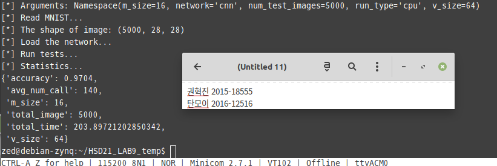

# LAB 09 Report

- 권혁진 2015-18555
- 탄모이 2016-12516

---

## Implementation

### Convolution Lowering

Naive implementation of convolution operation requires multiple nested loops which have big overhead and are hard to be optimized for hardware accelaration. So we need to transform this into matrix-matrix multiplication problem.

The matrix form of convolution filters can be easily obtained just by flattening the filters. Each filter corresponds to each row of the filter matrix.

In case of input data, the matrix form can be obtained in similiar way. By flattening each tile of the input data matrix, we can get each column of the transformed input matrix.

### Matrix Tiling

We could tile two matrix for matrix-matrix multiplication in the same way we do in lab2.

---

It runs on the fpga board.

## Bench mark result and disccusion

1. MLP by `src/fpga_api_on_cpu.cpp.cpp`
   - `lab2-0.png`,`lab2-1.png`,`lab2-2.png`

| # test Images | v_size | m_size | accuracy | avg\_#\_call | total\_time(s) |
| ------------- | ------ | ------ | -------- | ------------ | -------------- |
| 100           | 32     | 32     | 0.97     | 2432         | 6.38           |
| 100           | 32     | 64     | 0.97     | 1235         | 6.58           |
| 100           | 64     | 32     | 0.97     | 1235         | 6.37           |
| 100           | 64     | 64     | 0.97     | 627          | 6.8            |
| 1000          | 32     | 32     | 0.92     | 2432         | 63.47          |

Average number of blockMV calls are depend on v_size and m_size.  But the accuracy are not affected significantly by the size of tile. There is overhead for tiling matrix but it is not that big.

With more test images, We could get more precise accuracy.

2. MLP by `src/fpga_api.cpp`
   - `lab9-mlp-0.png`,`lab9-mlp-1.png`,`lab9-mlp-2.png`

| # test Images | v_size | m_size | accuracy | avg\_#\_call | total\_time(s) |
| ------------- | ------ | ------ | -------- | ------------ | -------------- |
| 100           | 32     | 32     | 0.97     | 2432         | 6.12           |
| 100           | 32     | 64     | 0.97     | 1235         | 6.33           |
| 100           | 64     | 32     | 0.96     | 1235         | 6.21           |
| 100           | 64     | 64     | 0.97     | 627          | 6.66           |
| 1000          | 32     | 32     | 0.92     | 2432         | 60.58          |

Same with [previous discussion](#mlp1)

3. CNN by `src/fpga_api_on_cpu.cpp`
   - `lab9-conv-0.png`,`lab9-conv-1.png`,`lab9-conv-2.png`

| # test Images | v_size | m_size | accuracy | avg\_#\_call | total\_time(s) |
| ------------- | ------ | ------ | -------- | ------------ | -------------- |
| 100           | 32     | 32     | 1.0      | 150          | 1.36           |
| 100           | 32     | 64     | 1.0      | 150          | 1.54           |
| 100           | 64     | 32     | 1.0      | 76           | 4.08           |
| 100           | 64     | 64     | 1.0      | 76           | 4.30           |
| 1000          | 32     | 32     | 0.98     | 150          | 13.55          |

The accuracy is significantly higher than MLP.

Because the convolution operation does not use the variable, m_size, thr average number of largeMM call is depend on only v_size.

The tiling overhead is bigger than MLP. It's because the convolutional lowering generates the matrix which is exponentially bigger than original input data. So the overhead cannot be ignored any more.

Even the tiling overhead is much bigger than MLP, the total time is much shorter than MLP. It's because CNN can extract the features better than MLP so requires much smaller model than MLP.